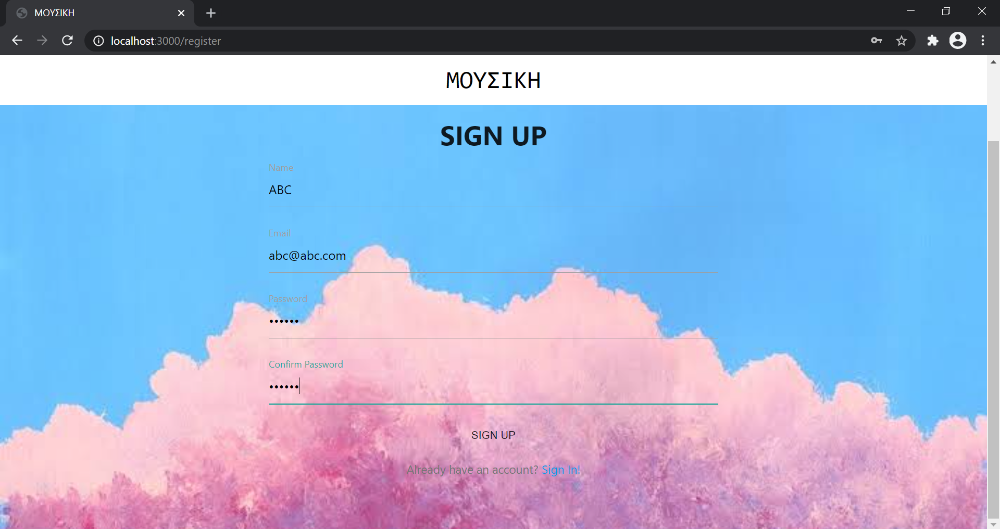
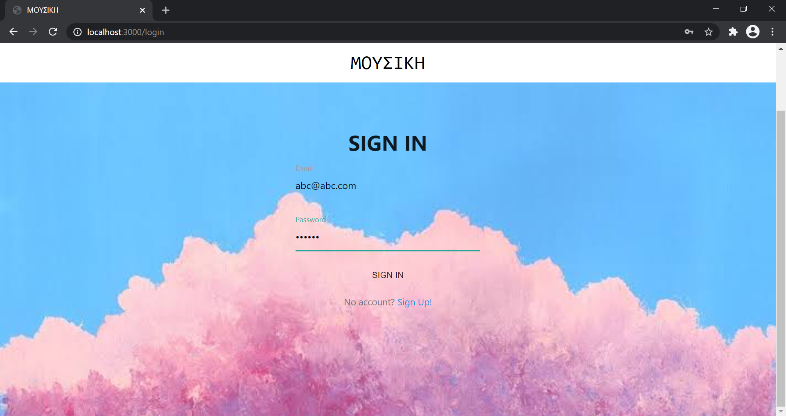
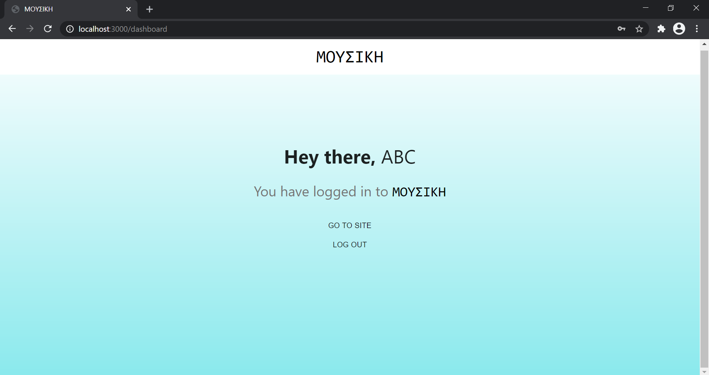
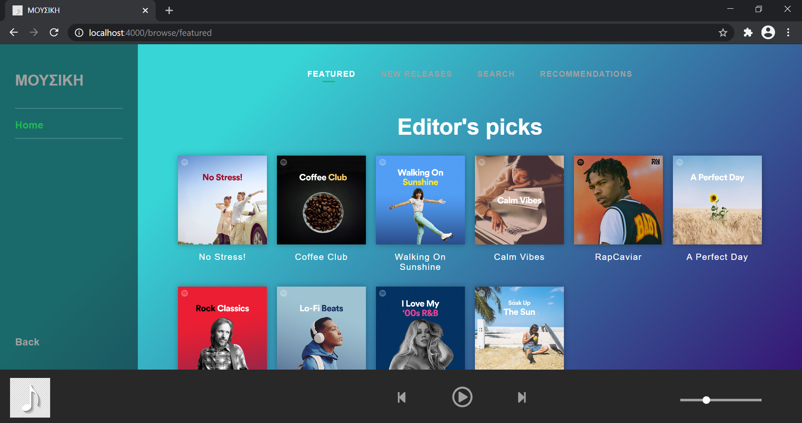
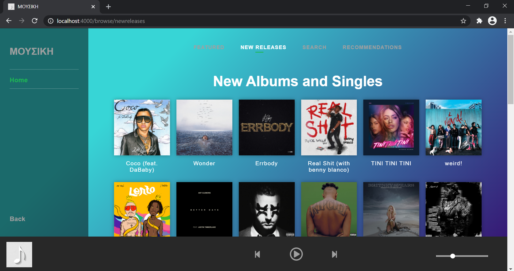
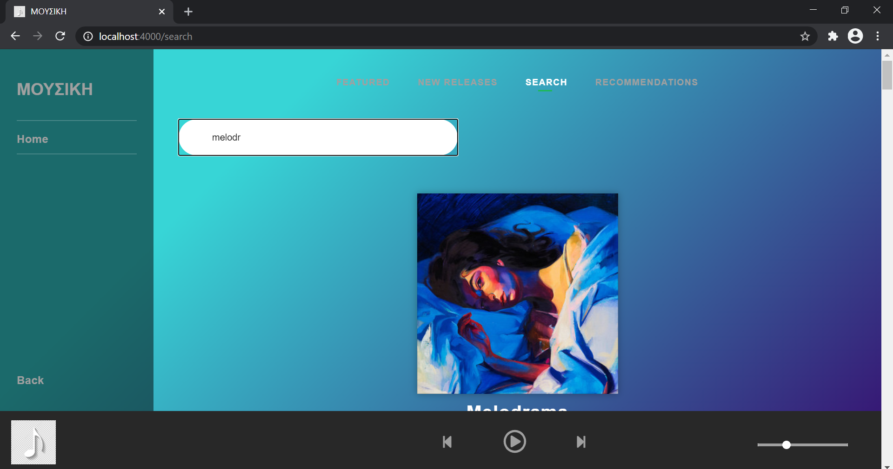
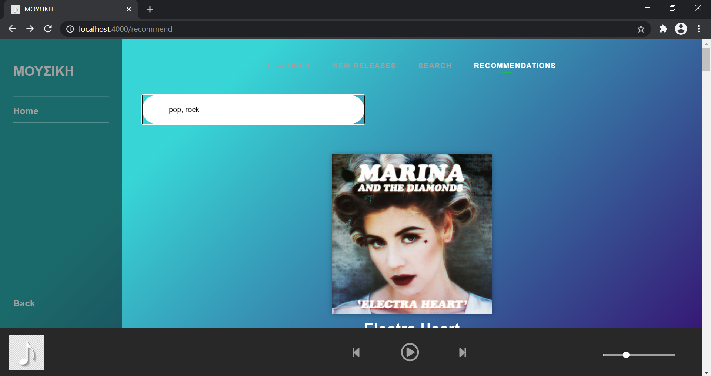
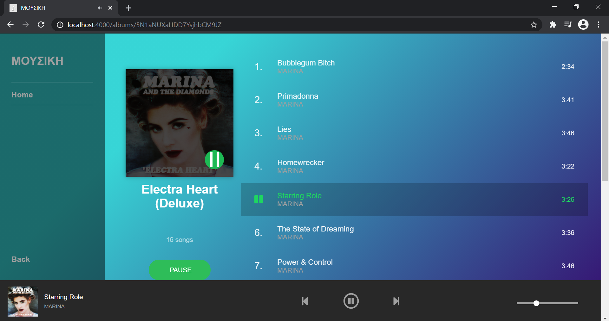

# Music Recommender System

A basic MERN stack web application that recommends albums to the user based on the genre(s) they choose. This project was done for the subject "Web Technologies" (UE19CS204).

## Folders
- Authentication: includes sign in, sign up, and the landing page
- Music: includes featured playlists, new releases, search, and recommendations

## Screenshots
- Sign Up:
<p align="center">
  
</p>

- Sign in:
<p align="center">
  
</p>

- Landing Page (Dashboard):
<p align="center">
  
</p>

- Featured Playlists:
<p align="center">
  
</p>

- New Releases:
<p align="center">
  
</p>

- Search:
<p align="center">
  
</p>

- Recommendations:
<p align="center">
  
</p>

- Playing Music:
<p align="center">
  
</p>

## Installation
To clone the repository, open terminal and type:
```bash
git clone https://github.com/kartika-nair/MusicRecommender.git
```

## Execution of Code
Open 2 terminals.

In terminal 1:
```bash
cd Authentication
npm i
cd client
npm i
cd ..
npm run dev
```

In terminal 2:
```bash
cd Music
npm i
npm start
```

## Team Members
- [Karthik Sairam](https://github.com/karthik-sairam)
- [Kartika Nair](https://github.com/kartika-nair)
- [Maitreyi P](https://github.com/Maitreyi-P)
